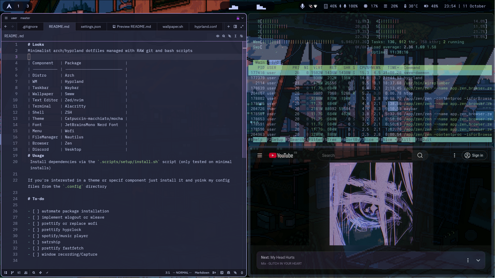

# Looks
Minimalist arch/hyprland dotfiles managed with RAW git and bash scripts

| Component   | Package                   |
| ----------- | ------------------------- |
| Distro      | Arch                      |
| WM          | Hyprland                  |
| Taskbar     | Waybar                    |
| Wallpaper   | Swww                      |
| Text Editor | Zed/nvim                  |
| Terminal    | Alacritty                 |
| Shell       | ZSH                       |
| Theme       | Catpuccin-macchiato/mocha |
| Font        | JetBrainsMono Nerd Font   |
| Menu        | Fuzzel                    |
| FileManager | Nautilus                  |
| Browser     | Zen                       |
| Discord     | Vesktop                   |
| Spotify     | Spicetify                 |
# Usage
 Install dependencies via the `.scripts/setup/install.sh` script (only tested on minimal installs)

If you're interested in a theme or specif component just install it and yoink my config files from the `.config` directory

# To-do

- [ ] automate package installation
- [ ] implement wlogout or wleave
- [X] prettify or replace wofi
- [ ] prettify hyprlock
- [X] spotify/music player
- [X] satrship
- [ ] prettify fastfetch
- [ ] window recording/Capture
